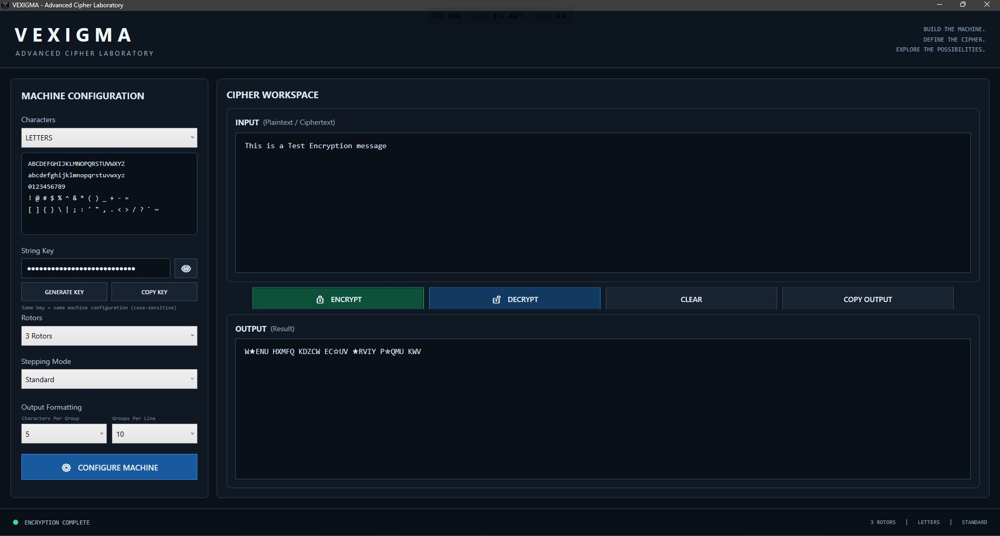

# VEXIGMA

### Advanced Cipher Laboratory

**VEXIGMA** is a configurable rotor-machine-inspired cipher application
for Windows. It provides an interactive laboratory for experimenting
with deterministic rotor configurations, multiple character sets,
stepping modes, configurable ciphertext formatting, and reproducible
String Keys.

> **Important:** VEXIGMA is experimental cryptographic software. It is
> not represented as meeting modern cryptographic security standards and
> should not be relied upon to protect sensitive, confidential,
> financial, authentication, safety-critical, high-value, or similarly
> consequential information.

## Features

-   Deterministic String Key system
-   Configurable rotor counts
-   Multiple rotor stepping modes
-   Multiple character modes
-   Case-sensitive and case-insensitive configurations
-   Letters, numbers, punctuation, and whitespace support
-   Encrypt and decrypt workflows
-   Configurable ciphertext grouping
-   Configurable groups per line
-   Copyable formatted output
-   Reconstructable machine configurations when the same key and
    settings are used
-   Standalone Windows x64 release

## Character Modes

VEXIGMA currently provides five character modes:

-   **LETTERS**
-   **SENSITIVE LETTERS**
-   **LETTERS & NUMBERS**
-   **SENSITIVE LETTERS & NUMBERS**
-   **ALL CHARACTERS**

Supported whitespace can participate in the cipher operation rather than
merely being preserved outside it.

## String Keys

VEXIGMA uses generated String Keys in the following general format:

`VEX-xxxxx-xxxxx-xxxxx-xxxxx`

The String Key deterministically generates the machine's rotor
permutations and related rotor parameters.

The String Key does **not** contain every machine setting. To reproduce
the same machine configuration, the same String Key and applicable
machine settings must be used.

Keep String Keys private when they are being used for material you do
not want others to reconstruct.

## Rotor Configuration

VEXIGMA supports configurable rotor counts and deterministic rotor
construction derived from the String Key.

Current rotor-count options include:

`3, 4, 5, 6, 8, 10`

The machine resets its rotor state for each encryption or decryption
operation so the same starting configuration can reproduce the
transformation.

## Stepping Modes

VEXIGMA currently includes:

### Standard

The first rotor advances for each supported character. Additional rotors
advance according to deterministic turnover positions generated from the
String Key.

### Sequential

The rotors behave in an odometer-style sequence, with the next rotor
advancing when the previous rotor completes a full cycle.

Additional stepping systems may be explored in future VEXIGMA versions.

## Output Formatting

Encrypted output can be formatted using configurable:

-   **Characters Per Group**
-   **Groups Per Line**

These formatting controls affect ciphertext presentation only. They do
not change the underlying machine configuration.

VEXIGMA may use visible transport symbols in ciphertext output to
represent encrypted whitespace values while reserving ordinary displayed
spaces and line breaks for cosmetic grouping.

## Deterministic Operation

Given the same:

-   String Key;
-   character mode;
-   rotor count;
-   stepping mode; and
-   input,

VEXIGMA is designed to reconstruct the same machine and produce the same
corresponding transformation.

Changing machine settings can produce a different result even when the
String Key is unchanged.

## Download

Compiled Windows releases should be obtained from the **official VEXIGMA
GitHub Releases page** once releases are published.

Official releases are distributed only by **NoxiousVex** or sources
expressly authorized by NoxiousVex.

Do not rely on unofficial mirrors or redistributed executables as
Official Releases.

## System Requirements

The current VEXIGMA release target is:

-   **Windows x64**
-   Self-contained application
-   No separate .NET installation should be required for the official
    self-contained build

## Running VEXIGMA

1.  Obtain `Vexigma.exe` from an official VEXIGMA release.
2.  Place the executable in a location of your choice.
3.  Launch `Vexigma.exe`.

Because early VEXIGMA releases may be unsigned, Windows may display
publisher or reputation warnings. Verify that the executable came from
an official VEXIGMA source before running it.

## Building from Source

VEXIGMA is currently developed as a Windows WPF application using:

-   **C#**
-   **WPF**
-   **.NET 10**
-   **Visual Studio**

To build the project:

1.  Clone or download the repository in accordance with the VEXIGMA
    License.
2.  Open the VEXIGMA project in a compatible Visual Studio installation
    with the required .NET desktop-development components.
3.  Restore any required project dependencies.
4.  Build the project using the desired configuration.

The official Windows release is intended to be published as a
self-contained `win-x64` single-file executable.

## Source-Available License

VEXIGMA is **source-available software, not open-source software**.

Public access to the source code does not grant unrestricted rights to
copy, redistribute, modify, incorporate, sell, sublicense, or
commercially exploit VEXIGMA.

Among other terms, the **VEXIGMA License v1.0** permits private
personal/non-commercial modification and defined educational/research
uses while restricting redistribution, commercial use, and incorporation
of VEXIGMA source into other projects without permission.

Read the complete `LICENSE.md` before using, modifying, forking, or
contributing to VEXIGMA.

**Copyright © 2026 NoxiousVex. All Rights Reserved.**

## Contributing

Contributions may be proposed through GitHub pull requests.

Before contributing, read:

-   `CONTRIBUTING.md`
-   `VEXIGMA-CLA.md`
-   `LICENSE.md`

A contribution cannot be accepted into official VEXIGMA until the
required VEXIGMA CLA declaration has been provided.

Public forks are permitted for contribution-development purposes subject
to the VEXIGMA License. They may not be independently distributed as
unofficial VEXIGMA releases.

## Security

Please do **not** use a public issue as the first place to disclose an
unpatched security vulnerability.

Security reports should be sent privately to:

**NoxiousVex1993@gmail.com**

VEXIGMA follows a coordinated vulnerability-disclosure process of up to
**90 days**. See `SECURITY.md` for the complete policy.

## Cryptographic Warning

VEXIGMA is intended as an experimental cipher laboratory.

Its rotor-based design should not be assumed to provide the
confidentiality, integrity, authentication, forward secrecy, resistance
to cryptanalysis, or other security properties expected from modern,
professionally reviewed cryptographic systems.

For real-world sensitive information, use established, independently
reviewed cryptographic tools and protocols appropriate to the task.

## Privacy and User Content

NoxiousVex claims no ownership merely through VEXIGMA use over user
plaintext, ciphertext, String Keys, machine configurations, or other
user-created content processed or generated through VEXIGMA.

Any future networking, update, telemetry, or data-handling functionality
may be documented separately if introduced.

## Project Status

VEXIGMA is under active development.

Features, interfaces, cipher behaviour, compatibility, and file/output
conventions may change between versions. Ciphertext generated by one
version should not automatically be assumed compatible with another
version unless explicitly documented.

## Author

**NoxiousVex**

Contact: **NoxiousVex1993@gmail.com**

## Repository Documents

-   `LICENSE.md` --- VEXIGMA License v1.0
-   `VEXIGMA-CLA.md` --- Contributor License Agreement
-   `CONTRIBUTING.md` --- Contribution process and requirements
-   `SECURITY.md` --- Vulnerability reporting and coordinated disclosure
-   `.gitignore` --- Repository exclusions

------------------------------------------------------------------------

**VEXIGMA --- Advanced Cipher Laboratory**